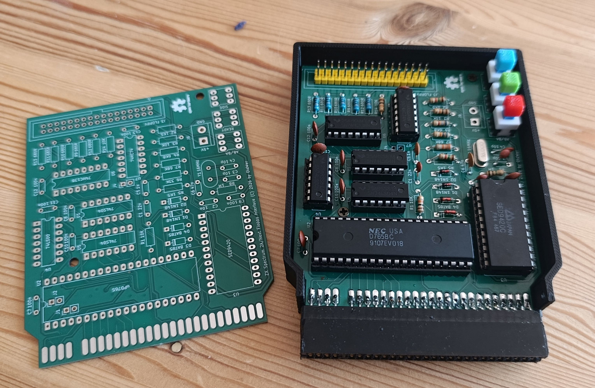
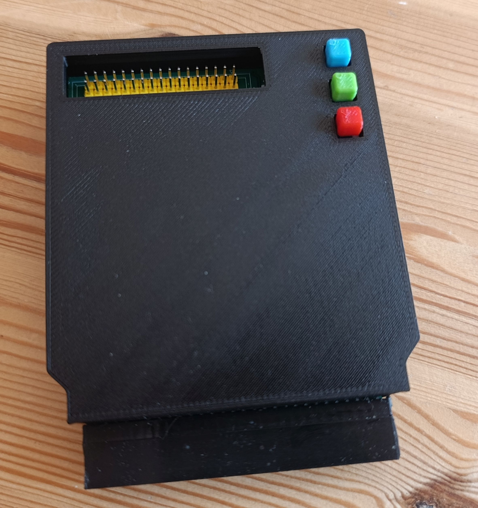
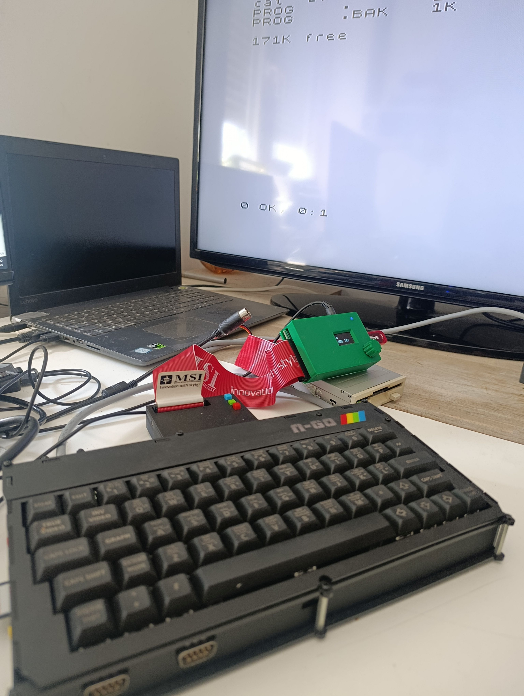

# Next-FDC
A floppy drive controller for the ZX Spectrum Next (issues 1 and 2) based on the ZX Spectrum +3 FDC circuit. I have previously designed a version of this FDC that is compatible with the ZX Spectrum +2A and „turns it” into Spectrum +3, but it requires three signals (DRD, DRW, MTR) that are not present on the Next’s expansion bus (this applies to issues 1 and 2, issue 3 will have these signals on the bus). However, they can be fairly easily synthesized externally based on several data/address lines and that’s what I have done in this version.

 The Next-FDC also works with regular ZX Spectrum +2A (and some clones, such as Sizif-512 and Harlequin 128), and I fully expect it to work with ZX Next issue 3 also (there just will be a little bit of redundancy, because in these cases the controller will create signals which are already being delivered by the computer itself).

Please note that in order to actually use the floppy drive with the Next you have to switch the computer into +3/+3e personality, change some settings and also issue several OUT commands (see below).
## How to make it?
The build is pretty self-explanatory. The gerbers are in the _gerbers_ directory; I have used recommended JLCPCB settings. The Bill of Materials is available in the _bom_ directory and all the parts are described on the PCB. The case model is available in the _STL_ directory. Actual FDC chips (uPD765 and SED9420) are still available pretty cheaply on Aliexpress (and I never got a fake one when ordering).

## How to use it?
In order to use the controller with the Next, you have to:
1. Switch the Next into +2A/+3 or +3e personality.
2. Press Space to go the configuration settings and disable DivmmcROM and DivmmcHW).
3. After reboot, go into +3 BASIC (or 48 BASIC).
4. Enter the following commands:
 __OUT 9275, 136: OUT 9531, 223__
   _(Writing 223 to port 136 disables DACs that interfere with the FDC operation.)_
 __OUT 9275, 138: OUT 9531, 8__
   _(Writing 8 to port 138 enables the port forwarding for port 1FFD to allow the I/O cycles to show up on the expansion bus.)_
 __OUT 9275, 128: OUT 9531, 8__
   _(Writing 8 to port 128 enables the expansion bus.)_
5. Press Reset button.
6. Now go into BASIC again, enter the CAT command and see if it works!
I know that's pretty convoluted, but who knows, maybe Next developers can be talked into adding an appropriate option to the menu? ;-)

## Buttons
There are three buttons on the controller:
* The upper one (blue on the photo): switches disk side – you can e.g. format one side of a 3,5” floppy, then press this button and format/use the other side.
* The middle one (green): forces the READY signal when using IBM disk drives.
* The lower one (red): swaps drives A and B.

All these buttons can be used when the computer is switched on (obviously not in the middle of a disk operation).
## General remarks
* To use two IBM floppy drives, please use a floppy cable with the twist. To use a Gotek and an IBM drive, set the Gotek to DS1 and use a cable with the twist.
* Please note that to use HD floppies you have to cover the HD hole (e.g. with a piece of self-adhesive tape).
* Many thanks to Allen Albright and Tim Gilberts from the ZX Spectrum Next FB group, who had helped me with configuring the Next to support the FDC.
* If in doubt, contact me at oldwer@op.pl, I will be happy to help.

